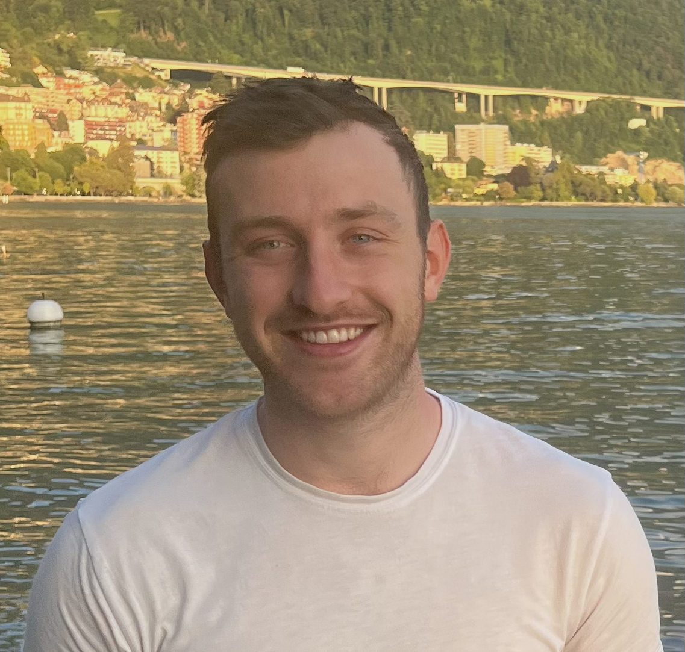

# An Introduction to Multi Modal Analysis using Networks

## Welcome Note
Welcome to our tutorial on the use of networks for multi-modal biomedical data analysis. We are very much looking forward to welcoming you to ISMB 2024 in Montreal this July.

We've designed our tutorial to show end-to-end working examples using real data from various disease datasets, including from cancer (from The Cancer Genome Atlas) and Autism (from published Gene Expression studies), as well as public health (from the Generation Scotland study). We've worked hard to create a series of detailed Python notebooks and accompanying data that you can take away with you after the tutorial and modify for use in your own study and research.

During the tutorial all you will need is a laptop as we have built a dedicated [JupyterHub](https://biomedicalai.inf.ed.ac.uk/jupyter/hub/login) server where you will be able to code live on a pre-installed environment. We have also made a JupyterBook of the tutorial that will be publicly available via our GitHub. All data and code will also be placed on the University of Edinburgh DataShare resource with a permanent DOI so it is available in perpetuity.

## Schedule of Events
```
Tutorial IP5: Modelling Multi-Modal Biomedical Data Using Networks
-------------------------------------------------------------------------
09:00 Welcome & Introduction
-------------------------------------------------------------------------
Section 1 – Introduction to Biomedical Networks
09:10 Part 1 - Gene Expression Networks
10:45 Coffee Break
11:00 Part 2 - Patient Similarity Networks 
----------------------------------------------------`---------------------
Section 2 –  Biomedical Network Analysis 
12:00 Part 1 – Over-representation and Enrichment Analysis
13:00 Lunch
14:00 Part 2 – Similarity Network Fusion
-------------------------------------------------------------------------
Section 3 – Machine Learning for Biomedical Networks
15:00 Part 1 – Message Passing
15:30 Part 2 – Problem Formulation & PSN Generation
16:00 Coffee Break
16:15 Part 3 – Classification using Graph Convolution Networks
17:00 Part 4 – Similarity Network Fusion with Graph Convolution Networks
-------------------------------------------------------------------------
17:50 Closing Remarks
```

## Table of Contents
We have developed a Jupyter Book containing all code and some extra materials to be used during the tutorial. 
```{tableofcontents}
```

## Meet the Team

<div style="display: flex; flex-wrap: wrap; gap: 20px;">

  <div style="flex: 1; min-width: 250px; text-align: center;">
    
    <h3>Ian Simpson</h3>
    <p>I am a Professor of Biomedical Informatics and Director of the UKRI AI Centre for Doctoral Training in Biomedical Innovation at the University of Edinburgh. I originally trained in Biochemistry and Genetics before moving into Biomedical Informatics.</p>
    <p>ian.simpson@ed.ac.uk</p>
  </div>

  <div style="flex: 1; min-width: 250px; text-align: center;">
    
    <h3>Barry Ryan</h3>
    <p>I am a student on the Biomedical AI CDT in Edinburgh. My thesis focuses on multi modal data integration to make informative inferences using networks. </p>
    <p>barry.ryan@ed.ac.uk</p>
  </div>

  <div style="flex: 1; min-width: 250px; text-align: center;">
    
    <h3>Chaeeun Lee</h3>
    <p>I am a UKRI CDT student in Biomedical AI in Edinburgh. My research focuses on Natural Language Processing (NLP) within the biomedical domain, addressing challenges such as factual hallucination and domain adaptation. </p>
    <p>chaeeun.lee@ed.ac.uk</p>
  </div>

</div>

<div style="display: flex; flex-wrap: wrap; gap: 20px;">

  <div style="flex: 1; min-width: 250px; text-align: center;">
    
    <h3>Sebestyén Kamp</h3>
    <p>I am a PhD student at the University of Edinburgh specialising in Graph Neural Networks (GNNs) and their applications in complex diseases, with a primary focus on omics data related to cancer and autism spectrum disorder.</p>
    <p>sebestyen.kamp@ed.ac.uk</p>
  </div>

  <div style="flex: 1; min-width: 250px; text-align: center;">
    
    <h3>Hanane Issa</h3>
    <p>I am a student in the HDRUK-Turing Wellcome PhD Programme in Health Data Science, based at the University of Edinburgh. My thesis will focus on patient similarity networks and explainable AI for rare disease diagnosis.</p>
    <p>h.issa@sms.ed.ac.uk</p>
  </div>


</div>

